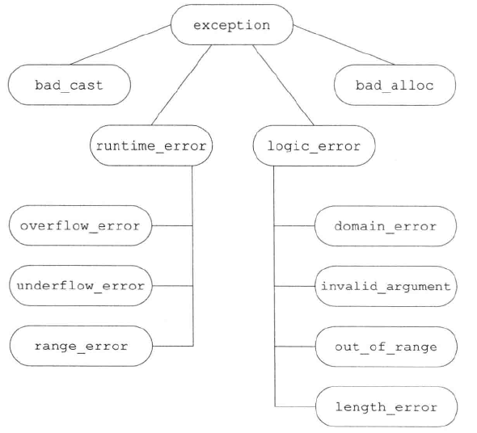

[toc]

# **第18章 用于大型程序的工具**

大规模编程对程序设计的特殊要求：

1. 在独立开发的子系统之间协同处理错误的能力。C++ 的异常处理满足此要求。
2. 使用各种库进行协同开发的能力。C++ 的命名空间满足此要求。
3. 对比较复杂的应用概念建模的能力。C++ 的多重继承满足此要求。

## **18.1 异常处理**

异常处理使得我们能够将问题的检测和解决过程分离开。

### **18.1.1 抛出异常**

C++ 中通过抛出（throw）一条表达式来引发一个异常。

被抛出的表达式的类型和当前的调用链共同决定了使用哪段处理代码来处理异常。

当执行了一个 throw 语句，跟在 throw 后的语句将不再执行，程序的控制权从 throw 语句转移到与之匹配的 catch 模块，catch 模块可能并不位于当前函数。

控制权的转移有两个含义：

1. 沿着调用链的函数可能会提早退出。
2. 一旦程序开始执行异常处理代码，则沿着调用链创建的对象将会被销毁。

throw 语句的用法有点类似 return 语句：一旦执行了此语句，后面的语句将不再执行。

**栈展开**

抛出异常后查找匹配的 catch 模块的过程是一个栈展开的过程：如果当前 try 语句块附近没有找到匹配的 cahch 语句，就继续向外层寻找。栈展开过程沿着嵌套函数的调用链不断查找，直到找到了匹配的 cahch 子句为止。

如果找到了匹配的 catch 子句就执行该子句中的代码。执行完后找到与 try 块关联的最后一个 catch 子句后的点继续执行。

如果没有找到匹配的 catch 子句程序将会调用 terminate 函数，终止程序的执行。

**栈展开过程中对象被自动销毁**

如果栈展开过程中退出了某个块，那么在这个块中创建的局部对象将会被销毁。

**析构函数与异常**

栈展开的过程中，类类型的局部对象的析构函数会被执行以销毁该对象。析构函数不应该抛出异常。如果析构函数需要执行某个可能抛出异常的操作，该操作应该放在 try 语句块中并在析构函数内部得到处理。

原因：当析构函数抛出了异常，又没有在析构函数内部完成处理的话，析构函数将会提早退出，导致没有完成对象的销毁工作。

**异常对象**

异常对象是一种特殊的对象，编译器使用 throw 表达式来对异常对象进行拷贝初始化。

异常对象位于编译器管理的空间中，编译器确保无论调用的是哪个 catch 子句，都能访问该空间。当异常处理结束后，该异常对象被销毁。

不能抛出一个指向局部异常对象的指针。

### **18.1.2 捕获异常**

catch 子句中的**异常声明**和函数形参有些类似。

声明的类型决定了处理代码所能捕获的异常类型。

进入 catch 语句后，将通过异常对象初始化异常声明中的参数。和函数参数类似，如果 catch 的参数类型是非引用类型，则该参数是异常对象的一个副本，如果参数是引用类型，则该参数是异常对象的一个别名。

如果 catch 的参数是**基类类型**，则可以使用派生类类型的异常对象对其进行初始化。此时如果 catch 的参数是非引用类型，则异常对象会被切掉一部分。如果 catch 的参数是基类的引用，该参数将以常规方式绑定到异常对象上。

异常声明的静态类型将决定 catch 语句所能执行的操作。

如果 catch 接受的异常与某个继承体系有关，**最好将该 catch 的参数定义为引用类型**。

**查找匹配的处理代码**

查找 catch 语句时，匹配到的 catch 语句是第一个与异常匹配的语句，而未必是最佳匹配。

当有多个 catch 子句时，应该合理调整 catch 子句的顺序，使得派生类异常的处理代码在基类异常的处理代码之前。

与实参和形参的匹配规则相比，异常和 catch 异常声明的匹配规则更严格一些，可以进行以下三种转换：

1. 允许从非常量向常量的类型转换；
2. 允许从派生类向基类的类型转换；
3. 数组被转换为指向数组（元素）类型的指针，函数被转换成指向该函数类型的指针。

**重新抛出**

有时，一个单独的 catch 语句不能完整地处理某个异常，这时要用到重新抛出。

一条 catch 语句可能通过重新抛出来将异常（这个异常是当前 catch 语句所捕获的异常）传递给另一个 catch 语句。这里的重新抛出仍然是一条 throw 语句，但不包含任何其他内容。

```c++
throw;
```

使用重新抛出语句后，当前的异常对象将沿着调用链向上传递。

**捕获所有异常的处理代码**

使用省略号作为异常声明，可以一次性捕获所有异常。

```c++
try{
    // 抛出异常的代码
}
catch(...){
    // 处理异常的操作
}
```

catch(...) 通常与重新抛出语句一起使用。

catch(...) 可以单独出现，也可以与其他几个 catch 语句一起出现。

### **18.1.3 函数try语句块与构造函数**

程序执行的任意时刻都可能发生异常，特别是构造函数初始化的过程中。

处理构造函数初始值异常的**唯一方法**就是将构造函数写成函数 try 语句块

函数 try 语句块使得一组 catch 语句既能处理构造函数体（或析构函数体），也能处理构造函数的初始化过程（或析构函数的析构过程）。

```c++
Student::Student(string &_name) 
try:                              // 关键字 try 位于表示初始值列表的冒号之前
    name(name) {/*函数体*/} 
catch(const bad_alloc &e) {}      // catch 语句位于构造函数体之后
```

**18.1.4 noexcept异常说明**

使用**关键字 noexcept** 放到函数的参数列表后面可以标识该函数不会抛出异常。

noexcept 需要出现在函数所有的声明语句和定义语句中。

```c++
void func(int) noexcept; // 不会抛出异常
void func(int) throw();  // 这个声明和上一条是等价的，这是 C++11 之前的旧版本。
```

**异常说明的实参**

noexcept 可以接受一个可选的实参，实参要能够转换为 bool 类型

```c++
void func(int) noexcept(true);  // 不会抛出异常
void func(int) noexcept(false); // 可能抛出异常
```

**noexcept运算符**

noexcept 说明符的实参常和 noexcept 运算符混合使用。

noexcept 运算符接受一个表达式，返回一个 bool 值，用来表示给定的表达式是否会抛出异常。

**noexcept 有两种含义：**

1. 跟在函数列表后时它是异常说明符。
2. 作为 noexcept 异常说明的 bool 实参出现时，它是一个运算符。

```c++
noexcept(func(i)) //如果 func 中调用的所有函数都做了不抛出声明且 func 本身不包含 throw 语句时，值为 true
```

**异常说明与指针、虚函数和拷贝控制**

如果函数做了不抛出声明，那么指向它的函数指针也必须做不抛出声明。

如果一个虚函数做了不抛出声明，派生的函数也必须做不抛出声明。

**18.1.5 异常类层次**

标准库异常类具有下图所示的继承关系。



继承体系的根部是 **exception 类**，它是最基本的异常类，仅表示某处出错了。

继承体系第二层将异常划分了两大类：**运行时错误**和**逻辑错误**。

所有的标准库异常类都有一个 **what 成员函数（是一个虚函数）**，它返回一个 const char*。

类 exception, bad_cast, bad_alloc 都定义了默认构造函数。

类 runtime_error 和 logic_error 都没有默认构造函数，但有一个接受 C 风格字符串或标准库 string 类型实参的构造函数。

实际的应用程序常常会自定义 exception 的派生类来扩展继承体系。


## **18.2 命名空间**

多个库将名字放置在全局命名空间中将引发命名空间污染。

命名空间可以用来防止名字冲突，它分割了全局命名空间。

### **18.2.1 命名空间定义**

**定义方法**

使用关键字 namespace 来定义命名空间。

只要能出现在全局作用域内的声明就能放到命名空间内。包括：类、变量、函数、模板和其他命名空间等。

```c++
namespace cpp_primer{
    class Sales_data{};
}  //无须分号
```


定义在某个命名空间内的名字可以被该命名空间内的其他成员直接访问，该命名空间之外的代码则需要明确指出命名空间来访问所用的名字。

**命名空间可以是不连续的**

命名空间可以定义在几个不同的部分。

命名空间中，类的定义、函数和对象的声明都应该放在头文件中，函数的定义等部分应该放到源文件中。

理解：不论是函数的声明还是定义，都要放在命名空间中，只是声明放在头文件，定义放在源文件而已。

**定义命名空间成员**

定义命名空间的成员有两种方法（都是在源文件中）

```c++
namespace cpp_primer{
    void func(){} // 在命名空间中直接定义函数
}
void cpp_primer::func(){} // 使用作用域运算符在命名空间外定义函数。
```

**模板特例化**

模板特例化必须定义在原始模板所属的命名空间中。可以在命名空间内声明，在命名空间外定义。

**全局命名空间**

全局作用域中定义的名字是定义在隐式的全局命名空间中。

作用域运算符同样可以用于全局作用域成员。

```c++
::Student  // 这表示定义在全局作用域中的 Student
```

**嵌套的命名空间**

命名空间可以嵌套。外层命名空间的成员要使用内层命名空间中的成员需要使用限定符来访问。

**内联命名空间**

内联命名空间是 C++11 新引入的一种嵌套命名空间。

内联命名空间中的名字可以被外层命名空间直接使用。

使用关键字 inline 定义内联命名空间

```c++
inline namespace FifthEd {}
```

**未命名的命名空间**

未命名的命名空间是关键字 namespace 后面直接跟花括号。

一个未命名的命名空间可以在一个文件内不连续，但不能跨越多个文件，它的作用域也仅限于该文件。

每个文件定义自己的未命名的命名空间，不同文件的未命名命名空间互不关联。

定义在未命名的命名空间中的名字可以**直接使用**，且不能对他们使用作用域运算符。

未命名的命名空间的作用域与该命名空间所在的作用域相同。

如果一个头文件定义了未命名的命名空间，且该头文件被多个文件所包含，则每个文件中都有该命名空间定义的名字的不同实体。

因此不要在头文件中使用匿名命名空间。

### **18.2.2 使用命名空间成员**

**命名空间的别名**

命名空间的别名声明也使用了关键字 namespace，别名声明的格式如下：

```c++
namespace primer = cpp_primer;// 使用别名 primer 来代替 cpp_primer 的名字。
```

**using 声明：扼要概述**

using 声明一次引入命名空间的一个成员。

using 声明的名字的作用域与 using 声明语句本身的作用域一致。

```c++
using std::cin;
```

**using 指示**

using 指示直接引入一整个命名空间。

using 指示不能用在类的作用域内。但是 using 声明是可以的。

```c++
using namespace std;
```

**using 指示与作用域**

using 指示令引入的命名空间成员的作用域提升到包含命名空间本身和 using 指示的最近作用域。

这与 using 声明不同：using 声明只是令名字在局部作用域内有效，相反 using 指示令整个命名空间的所有内容变得有效，而命名空间内会含有一些不能出现在局部作用域中的定义。

**头文件与 using 声明或指示**

头文件如果在其顶层作用域中含有 using 指示或 using 声明，则会将名字注入到所有包含了该头文件的文件中。

因此头文件最多只能**在它的函数或命名空间内**使用 using 指示或 using 声明。

**避免使用 using 指示**

一般不要使用 using 指示，很危险。

using 指示的用处：在命名空间本身的实现文件中可以使用 using 指示。

### **18.2.3 类、命名空间与作用域**

**实参相关的查找与类类型形参**

```c++
std::string s;
std::cin >> s;
```

重载操作符 >> 定义在标准库 string 中，string 定义在命名空间 std 中。但是不用 std:: 限定符就可以调用 >> 操作符。

这是因为：当我们给一个函数传递一个类类型的对象时，除了在常规的作用域查找外还会查找实参类所属的命名空间。

\>> 操作符的形参（iostream 和 string）是类类型的，所以编译器还会查找 iostream 和 string 所属的命名空间。

**查找与 std::move 和 std::forward** 

move 和 forward 都是模板函数，在标准库的定义中它们都接受一个右值引用的函数形参。在函数模板中，右值引用形参可以匹配任何类型。

所以如果用户自己也定义了一个 move 函数并且它只接受一个参数，那么必然会与标准库的 move 函数冲突。forward 函数也是如此。

所以 move 和 forward 的名字冲突非常频繁，使用时应该写 std::move 和 std::forward。

### **18.2.4 重载与命名空间**

**与实参相关的查找与重载**

已知对于接受类类型实参的函数来说，其名字查找会在实参类所属的命名空间中进行。

在有重载的情况下，将会在每个实参类（及实参类的基类）所属的命名空间中搜寻候选函数，找到的所有与被调用函数同名的函数都会被添加到候选函数集中。

**重载与 using 声明**

注意：using 声明语句声明的是**一个名字**，而非一个特定的函数。

所以用 using 引入一个函数时只用函数名就行了。

```c++
using std::find;        // 正确
using std::find(int);   // 错误
```

一个 using 声明引入的函数将会重载当前作用域内已有的其他同名函数（即 using 声明引入的函数与当前作用域中原有的函数互为对方的重载版本）。

如果 using 声明出现在局部作用域中，它引入的名字将会隐藏外部作用域中相同的名字。

如果使用 using 声明的作用域中存在与 using 声明引入的函数同名且形参列表也相同的函数，会产生错误。

**重载与 using 指示**

using 指示有一点不同于 using 声明：如果 using 指示引入的函数中存在与已有的函数同名且形参列表也相同的函数，不会产生错误。只需要调用时指明是哪个版本即可。

**跨越多个 using 指示的重载**

如果存在多个命名空间，则来自每个命名空间的名字都将成为候选函数集的一部分。

## **18.3 多重继承与虚继承**

多重继承：从多个直接基类中产生派生类（不是指一层层继承）

### **18.3.1 多重继承**

多重继承中，派生类的派生列表中的每个基类都包含一个可选的访问说明符。

**派生类构造函数初始化所有基类**

构造一个派生类的对象将同时构造并初始化它的所有基类子对象。

派生类构造函数调用各个基类的构造和函数来完成基类子对象的初始化，初始化顺序由基类在派生类表中的顺序决定。

**继承的构造函数与多重继承**

允许派生类从它的一个或几个基类中继承构造函数。

如果从多个基类中继承了相同的构造函数（即形参列表完全相同），会发生错误。这时派生类需要定义自己版本的具有同样形参列表的构造函数。

```c++
struct Base1{
    Base1(const string&);
}
struct Base2{
    Base2(const string&);
}
struct D : public Base1, public Base2{
    using Base1::Base1;
    using Base2::Base2;
    D(const string& s) : Base1(s), Base2(s) {} //定义自己的版本
}
```

**析构函数与多重继承**

析构函数的调用顺序与构造函数相反。

**多重继承的派生类的拷贝与移动操作**

与多重继承的派生类构造函数类似，多重继承的派生类的拷贝、移动或赋值操作也要调用各个基类的对应操作来完成对基类部分的处理。

### **18.3.2 类型转换与多个基类**

多重继承中，派生类的指针或引用可以自动转换成任意一个可访问基类的指针或引用。比如 D* 可以转换成 Base1* 或 Base2*。

**基于指针类型或引用类型的查找**

与只有一个基类的继承一样，对象、指针、引用的静态类型决定了能够使用哪些成员。

如果使用了基类 Base1 的指针，则只有定义在 Base1 中的操作是可以使用的。

### **18.3.3 多重继承下的类作用域**

多重继承的情况下，派生类的作用域嵌套在各个基类的作用域中。

在沿着继承体系查找名字时，查找过程会在所有的直接基类中同时进行，如果名字在多个基类中都被找到，则对该名字的使用具有二义性（如果通过前缀限定符来使用则没问题）。

要解决二义性最好的办法是在派生类中定义一个新版本。

### **18.3.4 虚继承**

在派生列表中同一个基类只能出现一次，但是派生类可以通过它的两个直接基类继承同一个间接基类（菱形继承），或直接继承某个基类，然后通过另一个基类再次间接继承该基类。

默认情况下，派生类中含有继承链上每个类对应的子部分，如果某个类在继承链上出现了多次，则派生类中将包含该类的多个子对象。

当包含多个基类的子对象时，访问基类的成员会出现二义性问题。

**虚继承**

某些情况下，派生类不希望包含同一种基类的多个子对象。比如 iosteram 类同时继承了 istream 和 ostream，而 istream 和 ostream 都继承了一个抽象基类 base_ios，iosteam 不希望有两个 base_ios 的子对象。

**虚继承**：令某个类做出声明（在派生列表中使用 virtual 关键字），承诺愿意共享它的基类，共享的基类子对象称为虚基类。

理解：使用虚继承的地方和虚继承产生效果的地方并不是同一个地方。如 istream 和 ostream 都虚继承了抽象基类 base_ios，此时虚继承的效果并未体现。之后 iostream 正常继承了 istream 和 ostream，此时虚继承的效果才会体现：iostream 中只有一个 base_ios 子对象（因为 istream 和 ostream 承诺了共享 base_ios）。

这种情况下，不管虚基类在继承体系中出现多少次，派生类中都只包含唯一一个共享的虚基类子对象。

```c++
class D : virtual public Base {}; // Base 是一个虚基类，其中 virtual 和 public 的顺序随意
```

**虚基类成员的可见性**

菱形继承中，基类成员的可见性情况会比较复杂。

例：基类 B 中定义了一个成员 x，D1 和 D2 虚继承了 B 类，D 则继承了 D1 和 D2。然后通过 D 的对象访问 x，会有 3 种情况：

1. D1 和 D2 并没有重写 x：没有问题，x 会被解析为 B 的成员。
2. D1 和 D2 中的某一个重写了 x：没有问题，派生类中的 x 享有比共享基类 B 中的 x 更高的优先级。
3. D1 和 D2 都重写了 x：会出现二义性的问题。解决问题的最好方式是在 D 中重新定义自己版本的 x。

### **18.3.5 构造函数与虚继承**

虚派生中，虚基类是由最低层的派生类（就是继承链中离虚基类最远的派生类）初始化的。

**虚继承的对象的构造方式**

含有虚基类的对象在初始化时，首先初始化虚基类子部分，再按照直接基类在派生列表中的顺序依次对其初始化。

如果一个类有多个虚基类，这些虚基类子对象按照它们在派生列表中出现的顺序依次构造。